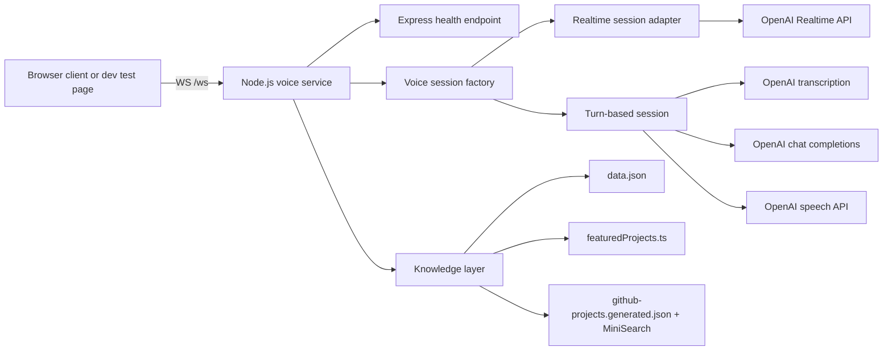

# Yubi Portfolio Voice Service

Node.js and TypeScript voice service for Yubi's portfolio. It exposes an HTTP health endpoint and a browser-facing WebSocket relay that supports two voice backends:

- `realtime`: low-latency duplex voice conversation using the OpenAI Realtime API
- `turn-based`: lower-cost STT -> chat -> TTS orchestration using standard OpenAI APIs

The service is grounded in preloaded portfolio knowledge so the assistant speaks in first person as Yubi and stays constrained to professional background, projects, and experience.

See [docs/ARCHITECTURE.md](docs/ARCHITECTURE.md) for the detailed architecture, diagrams, and decision rationale.
See [docs/DEPLOYMENT.md](docs/DEPLOYMENT.md) for deployment guidance, production checklist, and runbook notes.

## Table of Contents

- [What This Service Does](#what-this-service-does)
- [Current Status](#current-status)
- [Repository Layout](#repository-layout)
- [Architecture at a Glance](#architecture-at-a-glance)
- [Core Runtime Flows](#core-runtime-flows)
- [Getting Started](#getting-started)
- [Environment Variables](#environment-variables)
- [Available Scripts](#available-scripts)
- [Knowledge Model](#knowledge-model)
- [Voice Modes](#voice-modes)
- [WebSocket Contract](#websocket-contract)
- [Local Development Workflow](#local-development-workflow)
- [Deployment Notes](#deployment-notes)
- [Operational Guardrails](#operational-guardrails)
- [Known Gaps](#known-gaps)
- [Related Documents](#related-documents)

## What This Service Does

This service sits between a browser voice client and OpenAI. Its responsibilities are:

- accept browser microphone audio over a WebSocket connection
- manage one voice session per browser connection
- inject portfolio persona and knowledge before response generation
- stream assistant audio and transcript events back to the browser
- enforce basic session guardrails such as origin checks, inactivity timeouts, and concurrent-session caps

This repository is intentionally not a full frontend application. It contains the voice backend plus a development-only browser test page at `/test` when running in development mode.

## Current Status

Implemented now:

- Express HTTP server with `/health`
- WebSocket endpoint at `/ws`
- `realtime` and `turn-based` voice modes behind a shared abstraction
- provider-backed persona and portfolio knowledge injection
- local GitHub project retrieval from generated project cards
- browser dev test page for manual end-to-end validation
- structured JSON logging to console and daily log files

Not implemented yet:

- production authentication on the WebSocket endpoint
- rate limiting
- Docker or deployment packaging
- real React portfolio integration inside this repository
- automated tests

## Repository Layout

```text
.
├── public/
│   └── test.html                     # Dev-only browser client
├── src/
│   ├── config.ts                     # Environment parsing and runtime defaults
│   ├── index.ts                      # Composition root
│   ├── http/
│   │   └── healthRouter.ts           # HTTP health route
│   ├── knowledge/
│   │   ├── buildSystemPrompt.ts      # Base persona/system prompt
│   │   ├── data.json                 # Core profile knowledge
│   │   ├── featuredProjects.ts       # Curated always-on project context
│   │   ├── githubProjects.ts         # Local project retrieval and ranking
│   │   ├── InMemoryProvider.ts       # Current provider implementation
│   │   └── github-projects.generated.json
│   ├── lib/
│   │   └── logger.ts                 # Structured logger
│   ├── relay/
│   │   ├── OpenAIRealtimeSession.ts  # Upstream Realtime session manager
│   │   └── relayHandler.ts           # Browser WS connection orchestration
│   ├── scripts/
│   │   └── syncGithubProjects.ts     # Offline GitHub catalog sync
│   └── voice/
│       ├── createVoiceSession.ts     # Mode selection factory
│       ├── RealtimeVoiceSessionAdapter.ts
│       ├── TurnBasedVoiceSession.ts
│       ├── VoiceEvents.ts
│       └── VoiceSession.ts
├── ai_voice_chat_feature_prd.md      # Design intent and product requirements
├── PROGRESS.md                       # Implementation checklist / progress log
└── README.md
```

## Architecture at a Glance



The most important structural choice is that the browser always talks to one backend WebSocket contract, while the backend decides which voice implementation to run.

## Core Runtime Flows

### Realtime Mode

1. Browser connects to `/ws`.
2. The server validates origin and concurrency limits.
3. The service builds the base system prompt from provider-backed portfolio knowledge.
4. The backend opens an upstream WebSocket to the OpenAI Realtime API.
5. The backend sends `session.update` with model, voice, VAD, transcription, and instructions.
6. Browser audio chunks are relayed upstream.
7. When transcription completes, the backend computes per-turn portfolio context and sends `response.create` manually.
8. OpenAI streams audio and transcript events back through the relay to the browser.

### Turn-Based Mode

1. Browser connects to `/ws`.
2. The backend creates a `TurnBasedVoiceSession` instead of the Realtime adapter.
3. Incoming PCM chunks are buffered locally.
4. Local RMS-based silence detection decides when a user utterance ends.
5. Buffered audio is transcribed with OpenAI transcription.
6. The backend builds a grounded chat request from base prompt, dynamic project context, and short history.
7. The assistant text is streamed to the browser.
8. The final assistant text is converted to PCM audio with OpenAI TTS and streamed back in chunks.

## Getting Started

### Prerequisites

- Node.js 20+
- npm
- OpenAI API key with access to the models you intend to use

### Install

```bash
npm install
```

### Configure Environment

Start from [.env.example](.env.example) and create a local `.env` file in the repository root.

```env
OPENAI_API_KEY=your_openai_api_key
PORT=3001
NODE_ENV=development
VOICE_MODE=realtime

# Optional voice tuning
OPENAI_VOICE=echo
TURN_BASED_TRANSCRIPTION_MODEL=whisper-1
TURN_BASED_CHAT_MODEL=gpt-4o-mini
TURN_BASED_TTS_MODEL=gpt-4o-mini-tts

# Optional guardrails
MAX_SESSION_DURATION_MS=300000
INACTIVITY_TIMEOUT_MS=30000
MAX_CONCURRENT_SESSIONS=3
ALLOWED_ORIGINS=http://localhost:5173,http://localhost:3000
```

### Run in Development

```bash
npm run dev
```

Then open:

- `http://localhost:3001/health`
- `http://localhost:3001/test` when `NODE_ENV=development`

### Build for Production-Like Execution

```bash
npm run build
npm start
```

## Environment Variables

| Variable | Required | Default | Purpose |
| --- | --- | --- | --- |
| `OPENAI_API_KEY` | Yes | None | Credentials for all OpenAI requests |
| `PORT` | No | `3001` | HTTP and WebSocket server port |
| `NODE_ENV` | No | `development` | Controls dev-only routes and debug logging |
| `VOICE_MODE` | No | `realtime` | Selects `realtime` or `turn-based` backend |
| `OPENAI_VOICE` | No | `echo` | Output voice for Realtime and TTS |
| `TURN_BASED_TRANSCRIPTION_MODEL` | No | `whisper-1` | STT model in turn-based mode |
| `TURN_BASED_CHAT_MODEL` | No | `gpt-4o-mini` | Chat model in turn-based mode |
| `TURN_BASED_TTS_MODEL` | No | `gpt-4o-mini-tts` | TTS model in turn-based mode |
| `TURN_BASED_SILENCE_THRESHOLD` | No | `0.015` | RMS threshold for local speech detection |
| `TURN_BASED_SILENCE_DURATION_MS` | No | `450` | Required silence to close a turn |
| `TURN_BASED_MIN_SPEECH_DURATION_MS` | No | `180` | Minimum speech duration before processing |
| `TURN_BASED_PCM_CHUNK_BYTES` | No | `4800` | Outbound audio chunk size |
| `TURN_BASED_MAX_HISTORY_MESSAGES` | No | `8` | Short chat history window |
| `MAX_SESSION_DURATION_MS` | No | `300000` | Hard cap for any single session |
| `INACTIVITY_TIMEOUT_MS` | No | `30000` | Auto-close idle sessions |
| `MAX_CONCURRENT_SESSIONS` | No | `3` | Cost guard on parallel sessions |
| `ALLOWED_ORIGINS` | No | empty | Comma-separated allowed browser origins |
| `GITHUB_TOKEN` | Only for sync | None | Token used by `npm run sync:github` |
| `GITHUB_USERNAME` | Only for sync | `yubi00` | GitHub account to sync |

## Available Scripts

| Script | Purpose |
| --- | --- |
| `npm run dev` | Start the service with `tsx watch` |
| `npm run build` | Compile TypeScript to `dist/` |
| `npm start` | Run the compiled output |
| `npm run typecheck` | Run TypeScript type checking without emitting files |
| `npm run sync:github` | Refresh `src/knowledge/github-projects.generated.json` from GitHub |

## Knowledge Model

The service uses a layered knowledge approach:

### 1. Base persona knowledge

Stored in `src/knowledge/data.json` and injected into the system prompt at session start. This includes:

- profile summary
- skills
- key projects
- work experience
- contact details

### 2. Curated featured-project routing

`featuredProjects.ts` provides lightweight routing for broad questions such as "what project are you most proud of?" where retrieval from the full GitHub catalog would be too noisy.

### 3. Local GitHub catalog retrieval

`github-projects.generated.json` contains structured project cards, and `githubProjects.ts` uses MiniSearch plus ranking heuristics to inject only the most relevant repo context per turn.

This design keeps the always-on prompt small while still supporting detailed project questions.

## Voice Modes

| Dimension | `realtime` | `turn-based` |
| --- | --- | --- |
| Transport to model | WebSocket | HTTP APIs |
| User experience | Near-duplex, lower latency | Speak, wait, reply |
| Barge-in behavior | Native cancel flow with server VAD support | Local interruption over active turn |
| Cost profile | Higher | Lower |
| State owner | OpenAI Realtime session | Local Node.js orchestration |
| Transcript source | Realtime events | Server-generated events |

Choose `realtime` for demos and the best conversational feel. Choose `turn-based` when cost predictability matters more than full duplex behavior.

## WebSocket Contract

The browser talks to one endpoint:

- `ws://localhost:3001/ws`

Common client messages:

- `input_audio_buffer.append`
- `response.cancel`

Common server messages observed by the dev test client:

- `session.created`
- `session.updated`
- `input_audio_buffer.speech_started`
- `input_audio_buffer.speech_stopped`
- `conversation.item.input_audio_transcription.completed`
- `response.created`
- `response.audio_transcript.delta`
- `response.audio_transcript.done`
- `response.audio.delta`
- `response.done`
- `response.cancelled`
- `relay.error`
- `session.closed`

Note that the codebase also contains a future-facing semantic contract in `src/voice/VoiceEvents.ts`. The current Realtime path still forwards OpenAI-flavored event shapes directly, while the turn-based path emits compatible equivalents.

## Local Development Workflow

### Validate basic service health

```bash
npm run dev
```

Check:

- `GET /health`
- browser access to `/test`

### Validate Realtime mode

```bash
VOICE_MODE=realtime npm run dev
```

Suggested manual checks:

- start speaking and confirm transcript and audio both stream
- interrupt while the assistant is talking and confirm cancellation works
- ask identity questions and confirm the answer is grounded in `data.json`
- ask about a GitHub repository by name and confirm repo-specific grounding is used

### Validate Turn-Based mode

```bash
VOICE_MODE=turn-based npm run dev
```

Suggested manual checks:

- speak one sentence and confirm transcription begins only after silence
- interrupt during assistant playback and confirm active response cancellation works
- ask broad project questions and confirm featured-project routing is sensible

### Refresh GitHub project knowledge

```bash
npm run sync:github
```

This updates `src/knowledge/github-projects.generated.json` from the configured GitHub account and token.

## Deployment Notes

This repository now includes a separate deployment and runbook document at [docs/DEPLOYMENT.md](docs/DEPLOYMENT.md).

Use that document for:

- production environment setup
- process management and reverse proxy guidance
- release checklist and rollback steps
- operational checks after deployment

## Operational Guardrails

The service already includes a small but important set of cost and safety controls:

- origin allowlist support for browser connections
- concurrent-session cap
- inactivity timeout
- maximum session duration
- structured logs with session IDs and event metadata

These are intentionally lightweight. They help control accidental cost and noisy traffic, but they are not a substitute for production-grade authentication, authorization, and rate limiting.

## Known Gaps

- `/ws` is not yet protected by application auth
- there is no IP or token-based rate limiting
- there are no automated tests yet; verification is manual through `/test`
- the frontend-facing event contract is only partially normalized across backends
- no deployment manifests are included yet

## Related Documents

- [docs/ARCHITECTURE.md](docs/ARCHITECTURE.md)
- [docs/DEPLOYMENT.md](docs/DEPLOYMENT.md)
- [ai_voice_chat_feature_prd.md](ai_voice_chat_feature_prd.md)
- [PROGRESS.md](PROGRESS.md)