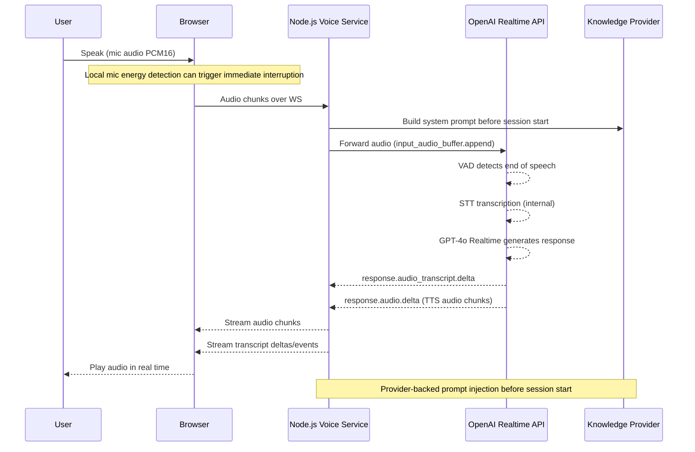

# Product Requirements Document (PRD)

## 1. Overview

This document outlines the design and implementation plan for adding a **real-time AI voice chat feature** to the existing AI-powered portfolio terminal.

The feature enables users to have a **1:1 audio conversation with an AI version of Yubi**, powered by the **OpenAI Realtime API** (WebSocket-based, handling STT + LLM + TTS in a single unified session), with future extensibility to video/avatar-based interaction.

---

## 2. Goals

### Primary Goals
- Enable real-time **audio-to-audio conversation**
- Achieve **low latency (<800ms to first response)**
- Support **interruptions (barge-in)**
- Maintain **natural conversational flow**
- Show **live streaming transcript** for both user and assistant

### Secondary Goals
- Reuse existing knowledge (resume, projects, RAG)
- Keep system **low-cost and scalable for low traffic**
- Extend to video/avatar in future

---

## 3. Non-Goals (MVP)

- Multi-user or group calls
- Recording or playback
- Perfect factual accuracy on first response
- Real-time GitHub API calls

---

## 4. Key Design Principles

1. **Speed over accuracy (first response)**
2. **Precomputed knowledge over live fetching**
3. **Streaming over blocking responses**
4. **Separation of concerns (voice vs terminal system)**

---

## 5. High-Level Architecture

### 5.1 Realtime Mode

```mermaid
graph TD

A[Frontend - React or Dev Test Page] -->|Terminal Mode| B[FastAPI Backend]
A -->|Voice Mode| C[Node.js Voice Service]

C --> D[OpenAI Realtime API - WSS]
D --> D1[STT - built-in]
D --> D2[GPT-4o Realtime - LLM]
D --> D3[TTS - built-in]
C --> E[Knowledge Provider]
E --> E1[InMemoryProvider - current]
E --> E2[RedisProvider - future]
C -->|Optional| B

B --> F[Neon Postgres (RAG)]
```

### 5.2 Turn-Based Mode

```mermaid
graph TD

A[Frontend - React or Dev Test Page] -->|Terminal Mode| B[FastAPI Backend]
A -->|Voice Mode| C[Node.js Voice Service]

C --> D[Turn-Based Voice Session]
D --> E[OpenAI STT]
D --> F[gpt-4o-mini Chat]
D --> G[OpenAI TTS]

C --> H[Knowledge Provider]
H --> H1[InMemoryProvider - current]
H --> H2[RedisProvider - future]

C -->|Optional| B
B --> I[Neon Postgres (RAG)]
```

### 5.3 Mode Selection

- `VOICE_MODE=realtime` → low-latency duplex conversation with native Realtime API semantics
- `VOICE_MODE=turn-based` → lower-cost speak-then-listen pipeline using STT + text generation + TTS
- Both modes reuse the same persona/knowledge layer and are intended to converge on the same frontend-facing event contract

---

## 6. System Components

### 6.1 Frontend
- Microphone input (MediaStream API)
- Audio playback
- Live transcript panel for user + assistant
- UI states:
  - Listening
  - Thinking
  - Speaking
  - Streaming transcript

---

### 6.2 Node.js Voice Service (NEW)

#### Responsibilities
- Proxy real-time audio between browser and **OpenAI Realtime API** over a secure WebSocket
- Manage the OpenAI Realtime session (session creation, config, system prompt injection)
- Handle server-side VAD events and interruption signals from OpenAI
- Inject persona context and knowledge-provider data into the session before conversation starts
- Forward `response.audio.delta` chunks back to the browser for streaming playback
- Enforce session guardrails such as inactivity timeout and max session duration

#### Technology
- **OpenAI Realtime API** (`wss://api.openai.com/v1/realtime`) — unified STT + LLM + TTS
- Model: `gpt-4o-realtime-preview`
- Transport: WebSocket (server-side relay pattern — browser → Node → OpenAI)

#### Non-Responsibilities
- No MCP/tool orchestration
- No heavy RAG processing
- No separate STT or TTS services (handled by OpenAI Realtime API)

---

### 6.3 FastAPI Backend (EXISTING)

#### Responsibilities
- Tool-based reasoning (MCP)
- RAG queries
- Data aggregation

---

### 6.4 Knowledge Provider Layer

#### Purpose
- Store precomputed persona/project knowledge
- Enable instant access for voice responses
- Preserve a clean swap point between in-memory storage now and Redis later

#### Current Implementation
- `InMemoryProvider` seeded from `data.json`
- `KnowledgeProvider` interface with Redis-compatible contract

#### Future Implementation
- `RedisProvider` using the same interface

---

## 7. Data Architecture

### 7.1 Knowledge Keys

Current provider keys:

#### Top Projects
```
projects:top -> summarized project list for prompt injection
```

#### Profile Summary
```
profile:summary -> short bio
```

#### Skills
```
profile:skills -> technology and domain summary
```

#### Experience
```
profile:experience -> work history summary
```

#### Contact
```
profile:contact -> email / portfolio / GitHub / LinkedIn
```

---

## 8. Knowledge Layers

### Layer 1: Instant Memory
- Top projects (5–10)
- Skills
- Summary

Used for: immediate responses

---

### Layer 2: Fast Retrieval
- In-memory lookup now, Redis lookup later
- Lightweight RAG (Neon)

Used for: follow-ups or specific queries

---

### Layer 3: Deep Processing
- MCP tools
- Full pipeline

Used for: terminal mode only or rare cases

---

## 9. Voice Response Flow



### OpenAI Realtime API Session Config

```json
{
  "model": "gpt-4o-realtime-preview",
  "modalities": ["text", "audio"],
  "voice": "alloy",
  "input_audio_transcription": { "model": "whisper-1" },
  "turn_detection": {
    "type": "server_vad",
    "threshold": 0.5,
    "silence_duration_ms": 600
  },
  "instructions": "<persona + knowledge-provider context + guardrails injected here>"
}
```

---

## 10. Response Strategy

### Fast Path (Default)
- Direct LLM response
- Uses only instant memory
- No tools

### Slow Path (Optional)
- Triggered for detailed queries
- Fetch from Redis or RAG
- Used in subsequent responses

---

## 11. Latency Targets

With OpenAI Realtime API, STT, LLM, and TTS are handled in a **single streaming pipeline** — there is no sequential hand-off between separate services.

| Component | Target | Notes |
|----------|--------|-------|
| Audio capture → OpenAI | ~50ms | Browser WS relay via Node |
| VAD end-of-speech detection | 200–600ms | Configurable `silence_duration_ms` |
| First audio chunk back | 300–600ms | GPT-4o realtime streams TTS directly |
| **Total perceived latency** | **<800ms** | End-to-end |

> Previous architecture had separate STT → LLM → TTS hops. OpenAI Realtime API collapses these into one, significantly reducing total latency.

---

## 12. Interrupt Handling

### Requirements
- Detect user speech during AI response
- Cancel current response
- Start new processing cycle

### Mechanism (Implemented)
- **Local mic-energy interrupt detection** cuts playback quickly on the browser side
- **Server-side VAD** from OpenAI still provides authoritative speech events
- Browser sends `response.cancel` upstream and truncates queued local audio
- Browser must keep tracking queued audio until playback actually drains; `response.done` is not enough on its own

---

## 13. Data Freshness Strategy

### Background Job
- Runs on deploy or periodically
- Fetches GitHub data
- Generates summaries
- Updates Redis

---

## 14. Technology Stack

### Frontend
- React
- Web Audio API

### Voice Backend
- Node.js
- WebSocket relay

### AI
- **OpenAI Realtime API** (`gpt-4o-realtime-preview`) — unified STT + LLM + TTS
- Voice: `alloy` (configurable)
- Transport: WebSocket (`wss://api.openai.com/v1/realtime`)
- No separate Whisper, ElevenLabs, or TTS service required

### Data
- In-memory knowledge store now, Redis-ready provider abstraction
- Neon Postgres (existing)

---

## 15. Implementation Phases

### Phase 1: Basic Audio Chat
- Relay scaffold, browser audio capture/playback, realtime session setup

### Phase 2: Continuous Conversation
- Continuous conversation, server VAD, error forwarding, session management

### Phase 3: Interruptions
- Barge-in handling, playback cancellation, local interrupt detection, inactivity guards

### Phase 4: Memory Integration
- Knowledge provider abstraction, in-memory persona data, system-prompt injection, guardrails, live transcript

### Phase 5: Voice Backend Abstraction
- Introduce a `VoiceSessionService`-style abstraction
- Keep the current Realtime path as one implementation, wrapped by an adapter rather than rewritten
- Add a lower-cost turn-based STT + LLM + TTS implementation
- Select implementation via config without changing frontend-facing contracts
- Preserve the current Realtime behavior for demos/dev while adding the cheaper production path in parallel
- Turn-based flow: browser PCM utterance -> server-side silence detection -> transcription -> `gpt-4o-mini` text generation -> TTS PCM playback

### Phase 6: React Integration
- Integrate voice chat into the real portfolio frontend
- Reuse the same event/transcript contract regardless of backend mode

### Phase 7: Optional Enhancements
- Redis provider swap
- Avatar/video
- Smarter RAG triggers

---

## 16. Risks & Trade-offs

### Risks
- **OpenAI Realtime API cost** — priced per audio token, can add up with long sessions
- **Single vendor dependency** — all STT/LLM/TTS in OpenAI; no fallback
- **Browser audio format** — must send PCM16 at 24kHz; encoding must be correct
- **WebSocket relay complexity** — Node.js acts as a relay; any crash breaks the session
- **Context window limits** — system prompt + Redis data must fit within model context
- **Transcript/audio drift** — transcript generation may finish before queued audio playback drains

### Trade-offs
- Speed + simplicity vs vendor lock-in (chose OpenAI Realtime API for both)
- Preloaded provider-backed knowledge vs live RAG (preload wins for latency)
- Server VAD plus local interrupt detection vs server-only VAD (hybrid chosen for faster barge-in)
- Realtime mode gives barge-in + full duplex feel; turn-based mode is much cheaper but behaves like speak-then-listen

---

## 17. Future Enhancements

- Avatar-based video chat
- Emotion-aware responses
- Personalized voice cloning
- Multi-session memory

---

## 18. Summary

The system introduces a dedicated **voice-first architecture** that prioritizes speed and conversational flow, while leveraging existing systems for deeper knowledge when required.

Core idea:

> Precompute knowledge → inject into OpenAI Realtime session → stream transcript and audio back instantly

### Key Technical Decision

**OpenAI Realtime API** is the single AI engine for this feature:
- Replaces separate STT (Whisper), LLM (chat completions), and TTS (ElevenLabs/OpenAI TTS) services
- One WebSocket session handles the full audio-in → audio-out pipeline
- Built-in VAD and barge-in support simplifies interrupt handling
- Node.js voice service acts as a **secure relay** between browser and OpenAI

