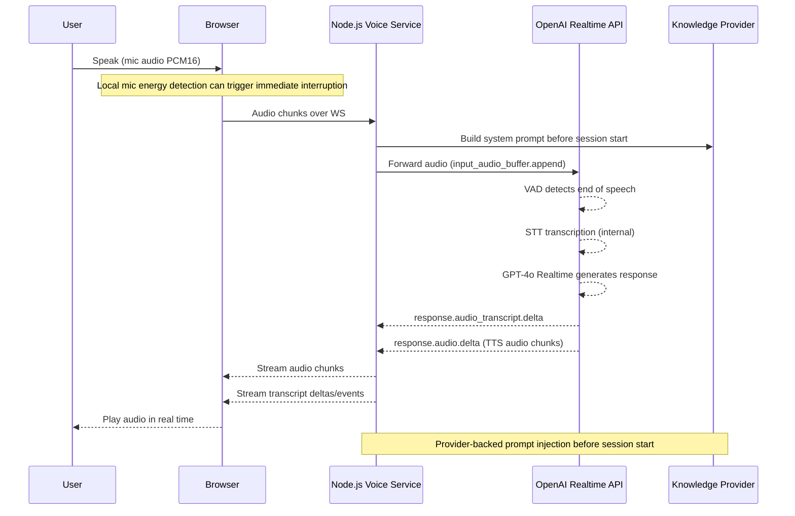

# Product Requirements Document (PRD)

## 1. Overview

This document outlines the design and implementation plan for adding a **real-time AI voice chat feature** to the existing AI-powered portfolio terminal.

The feature enables users to have a **1:1 audio conversation with an AI version of Yubi**, powered by the **OpenAI Realtime API** (WebSocket-based, handling STT + LLM + TTS in a single unified session), with future extensibility to video/avatar-based interaction.

---

## 2. Goals

### Primary Goals
- Enable real-time **audio-to-audio conversation**
- Achieve **low latency (<800ms to first response)**
- Support **interruptions (barge-in)**
- Maintain **natural conversational flow**
- Show **live streaming transcript** for both user and assistant

### Secondary Goals
- Reuse existing knowledge (resume, projects, RAG)
- Keep system **low-cost and scalable for low traffic**
- Extend to video/avatar in future

---

## 3. Non-Goals (MVP)

- Multi-user or group calls
- Recording or playback
- Perfect factual accuracy on first response
- Real-time GitHub API calls

---

## 4. Key Design Principles

1. **Speed over accuracy (first response)**
2. **Precomputed knowledge over live fetching**
3. **Streaming over blocking responses**
4. **Separation of concerns (voice vs terminal system)**

---

## 5. High-Level Architecture

### 5.1 Realtime Mode

```mermaid
graph TD

A[Frontend - React or Dev Test Page] -->|Terminal Mode| B[FastAPI Backend]
A -->|Voice Mode| C[Node.js Voice Service]

C --> D[OpenAI Realtime API - WSS]
D --> D1[STT - built-in]
D --> D2[GPT-4o Realtime - LLM]
D --> D3[TTS - built-in]
C --> E[Knowledge Provider]
E --> E1[InMemoryProvider - current]
E --> E2[RedisProvider - future]
C -->|Optional| B

B --> F[Neon Postgres (RAG)]
```

### 5.2 Turn-Based Mode

```mermaid
graph TD

A[Frontend - React or Dev Test Page] -->|Terminal Mode| B[FastAPI Backend]
A -->|Voice Mode| C[Node.js Voice Service]

C --> D[Turn-Based Voice Session]
D --> E[OpenAI STT]
D --> F[gpt-4o-mini Chat]
D --> G[OpenAI TTS]

C --> H[Knowledge Provider]
H --> H1[InMemoryProvider - current]
H --> H2[RedisProvider - future]

C -->|Optional| B
B --> I[Neon Postgres (RAG)]
```

### 5.3 Mode Selection

- `VOICE_MODE=realtime` → low-latency duplex conversation with native Realtime API semantics
- `VOICE_MODE=turn-based` → lower-cost speak-then-listen pipeline using STT + text generation + TTS
- Both modes reuse the same persona/knowledge layer and are intended to converge on the same frontend-facing event contract

---

## 6. System Components

### 6.1 Frontend
- Microphone input (MediaStream API)
- Audio playback
- Live transcript panel for user + assistant
- UI states:
  - Listening
  - Thinking
  - Speaking
  - Streaming transcript

#### Intended Product Positioning
- The voice experience should feel like an interactive interview with Yubi, not a generic support chatbot
- In voice mode, the assistant should speak in first person as Yubi by default
- The UI should feel like part of the portfolio itself, not a floating help widget bolted onto the page

#### Intended UX Direction For React Frontend
- Prefer an embedded voice panel or console-style surface over a small chat bubble
- The visual tone should sit between a modern terminal and a polished editor panel: calm, intentional, and professional
- Transcript should be first-class so users can read responses even if they do not want to listen continuously
- Desktop layout should prioritize an always-visible conversation area; mobile layout can collapse into a bottom sheet or focused panel

#### Core Voice UI States
- `idle`: clear entry point such as "Talk to Yubi" with a short hint about asking about projects, skills, or experience
- `listening`: active mic state with obvious visual feedback such as pulse, waveform, or animated indicator
- `thinking`: brief transition state after the user finishes speaking and before Yubi starts responding
- `speaking`: streamed assistant transcript plus subtle speaking indicator while audio plays
- `error`: clear recovery message with a retry path

#### Desired Interaction Style
- Responses should sound natural, like Yubi answering interview questions, not like a scripted narrator reading profile data
- The frontend should reinforce that tone by avoiding overly robotic labels or call-center style UI language
- Suggested transcript styling:
  - user turns feel lightweight and prompt-like
  - assistant turns feel more editorial and readable
  - system state should stay minimal and non-intrusive

#### Suggested React Integration Shape
- A dedicated `VoiceChat` component should manage:
  - connection lifecycle
  - mic permissions
  - current session state
  - streamed transcript rendering
  - audio playback state
- Keep the voice feature independent from the existing terminal state so voice and terminal modes do not fight over shared UI state
- The React integration should be able to reuse the same backend event contract for both `realtime` and `turn-based` modes

#### MVP Frontend Experience
- Open voice panel
- User sees a short intro line explaining they can ask about Yubi's skills, projects, or work experience
- User speaks naturally
- Transcript appears live
- Assistant responds with audio and text in the same panel
- User can interrupt and ask a follow-up without leaving the conversation surface

---

### 6.2 Node.js Voice Service (NEW)

#### Responsibilities
- Proxy real-time audio between browser and **OpenAI Realtime API** over a secure WebSocket
- Manage the OpenAI Realtime session (session creation, config, system prompt injection)
- Handle server-side VAD events and interruption signals from OpenAI
- Inject persona context and knowledge-provider data into the session before conversation starts
- Forward `response.audio.delta` chunks back to the browser for streaming playback
- Enforce session guardrails such as inactivity timeout and max session duration

#### Technology
- **OpenAI Realtime API** (`wss://api.openai.com/v1/realtime`) — unified STT + LLM + TTS
- Model: `gpt-4o-realtime-preview`
- Transport: WebSocket (server-side relay pattern — browser → Node → OpenAI)

#### Non-Responsibilities
- No MCP/tool orchestration
- No heavy RAG processing
- No separate STT or TTS services (handled by OpenAI Realtime API)

---

### 6.3 FastAPI Backend (EXISTING)

#### Responsibilities
- Tool-based reasoning (MCP)
- RAG queries
- Data aggregation

---

### 6.4 Knowledge Provider Layer

#### Purpose
- Store precomputed persona/project knowledge
- Enable instant access for voice responses
- Preserve a clean swap point between in-memory storage now and Redis later

#### Current Implementation
- `InMemoryProvider` seeded from `data.json`
- `KnowledgeProvider` interface with Redis-compatible contract

#### Future Implementation
- `RedisProvider` using the same interface

---

## 7. Data Architecture

### 7.1 Knowledge Keys

Current provider keys:

#### Top Projects
```
projects:top -> summarized project list for prompt injection
```

#### Profile Summary
```
profile:summary -> short bio
```

#### Skills
```
profile:skills -> technology and domain summary
```

#### Experience
```
profile:experience -> work history summary
```

#### Contact
```
profile:contact -> email / portfolio / GitHub / LinkedIn
```

---

## 8. Knowledge Layers

### Layer 1: Instant Memory
- Top projects (5–10)
- Skills
- Summary

Used for: immediate responses

---

### Layer 2: Fast Retrieval
- In-memory lookup now, Redis lookup later
- Lightweight RAG (Neon)

Used for: follow-ups or specific queries

---

### Layer 3: Deep Processing
- MCP tools
- Full pipeline

Used for: terminal mode only or rare cases

---

## 9. Voice Response Flow



### OpenAI Realtime API Session Config

```json
{
  "model": "gpt-4o-realtime-preview",
  "modalities": ["text", "audio"],
  "voice": "alloy",
  "input_audio_transcription": { "model": "whisper-1" },
  "turn_detection": {
    "type": "server_vad",
    "threshold": 0.5,
    "silence_duration_ms": 600
  },
  "instructions": "<persona + knowledge-provider context + guardrails injected here>"
}
```

### Current Backend Reality

The backend implementation now differs slightly from the original idealised design above. The frontend repo should treat the following as the source of truth:

- Browser connects to the Node.js voice backend over a single WebSocket endpoint at `/ws`
- Browser can also use `/health` for a lightweight availability check
- The backend supports two modes selected by server config, not by the browser:
  - `realtime`
  - `turn-based`
- Both modes are intended to converge on one frontend-facing contract, but today the Realtime path still forwards mostly OpenAI-shaped events while the turn-based path emits compatible equivalents
- Authentication is optional and backend-controlled: when `REQUIRE_AUTH=true`, the voice service verifies the same short-lived HS256 access token format issued by the FastAPI backend

### Frontend Integration Contract (Current)

#### Backend URL Assumptions

- HTTP health check: `GET /health`
- WebSocket endpoint: `ws(s)://<voice-service-host>/ws`
- Frontend project should expose its own env var such as `VITE_VOICE_WS_URL` or derive the URL from a backend base URL
- If voice auth is enabled, the frontend must append the access token as `?access_token=<token>` when opening the WebSocket
- Frontend should treat voice-token attachment as connection-time behavior only; token issuance and refresh stay in the main FastAPI auth flow

#### Audio Input Requirements

- Browser captures microphone audio with `getUserMedia`
- Browser streams mono PCM16 audio at 24 kHz to the backend
- Audio chunks are sent as base64 inside JSON messages
- The backend expects `input_audio_buffer.append` messages during active capture

Client message shape:

```json
{
  "type": "input_audio_buffer.append",
  "audio": "<base64 pcm16 mono 24khz>"
}
```

Interrupt / cancel message shape:

```json
{
  "type": "response.cancel"
}
```

Auth handshake behavior:

- If `REQUIRE_AUTH=false`, connect directly to `/ws`
- If `REQUIRE_AUTH=true`, fetch or refresh the short-lived access token from the FastAPI backend first, then open `/ws?access_token=<token>`
- Token minting and refresh remain responsibilities of the FastAPI backend, not the voice service
- If the token is missing, expired, malformed, or signed with the wrong secret, the voice service rejects the WebSocket before session creation
- After a WebSocket session is accepted, the voice service does not re-authenticate mid-session; expiry matters for the next connect or reconnect, not for every minute of an already-active conversation

#### Server Events The Frontend Must Handle

The frontend implementation should be prepared for the following server event types today:

- `session.created`
- `session.updated`
- `session.closed`
- `relay.error`
- `error`
- `response.created`
- `response.audio.delta`
- `response.audio_transcript.delta`
- `response.audio_transcript.done`
- `response.done`
- `response.cancelled`
- `conversation.item.input_audio_transcription.delta`
- `conversation.item.input_audio_transcription.completed`
- `input_audio_buffer.speech_started`
- `input_audio_buffer.speech_stopped`

#### Event Semantics The Frontend Should Assume

- `session.created`: connection accepted; can include session id and active mode
- `session.updated`: backend session configuration is ready
- `response.created`: assistant has started a new response turn
- `response.audio.delta`: base64 PCM audio chunk to queue for playback
- `response.audio_transcript.delta`: assistant transcript chunk to append live
- `response.audio_transcript.done`: assistant transcript is complete, but queued audio may still still be draining locally
- `conversation.item.input_audio_transcription.delta`: optional live user transcript chunk
- `conversation.item.input_audio_transcription.completed`: final user transcript for the turn
- `response.done`: backend has finished emitting the response; frontend should still let queued audio finish naturally
- `response.cancelled`: current assistant turn was interrupted or cancelled; frontend should stop queued playback immediately
- `input_audio_buffer.speech_started`: authoritative speech-start signal from backend / provider VAD
- `session.closed`: terminal state for the current session; frontend should reset UI and reconnect only via explicit user action or deliberate reconnect logic

#### Browser Responsibilities

The frontend repo should own:

- microphone permission flow
- AudioContext lifecycle and unlock behavior
- PCM16 resampling / encoding to 24 kHz mono
- outbound audio chunk streaming cadence
- inbound audio queueing and gap-free playback
- transcript rendering for user and assistant
- local interruption handling while assistant audio is playing
- user-visible connection / error / retry states
- obtaining a fresh FastAPI access token before voice connect when auth is enabled
- distinguishing auth rejection from generic connection failure so retry can refresh token instead of blindly reconnecting

#### Important Playback Detail

The frontend must not assume that `response.done` means audio playback has audibly finished. The backend may be done sending chunks while the browser still has queued audio scheduled for playback. The UI should track actual local playback drain separately from backend response completion.

#### Current Compatibility Note

There is a future semantic event contract defined conceptually as:

- `voice.state`
- `voice.transcript.delta`
- `voice.transcript.done`
- `voice.error`
- `voice.session.closed`

But the frontend should not depend on those semantic event names yet. For the current implementation, it should code against the concrete event list above.

---

## 10. Response Strategy

### Fast Path (Default)
- Direct LLM response
- Uses only instant memory
- No tools

### Slow Path (Optional)
- Triggered for detailed queries
- Fetch from Redis or RAG
- Used in subsequent responses

---

## 11. Latency Targets

With OpenAI Realtime API, STT, LLM, and TTS are handled in a **single streaming pipeline** — there is no sequential hand-off between separate services.

| Component | Target | Notes |
|----------|--------|-------|
| Audio capture → OpenAI | ~50ms | Browser WS relay via Node |
| VAD end-of-speech detection | 200–600ms | Configurable `silence_duration_ms` |
| First audio chunk back | 300–600ms | GPT-4o realtime streams TTS directly |
| **Total perceived latency** | **<800ms** | End-to-end |

> Previous architecture had separate STT → LLM → TTS hops. OpenAI Realtime API collapses these into one, significantly reducing total latency.

---

## 12. Interrupt Handling

### Requirements
- Detect user speech during AI response
- Cancel current response
- Start new processing cycle

### Mechanism (Implemented)
- **Local mic-energy interrupt detection** cuts playback quickly on the browser side
- **Server-side VAD** from OpenAI still provides authoritative speech events
- Browser sends `response.cancel` upstream and truncates queued local audio
- Browser must keep tracking queued audio until playback actually drains; `response.done` is not enough on its own

---

## 13. Data Freshness Strategy

### Background Job
- Runs on deploy or periodically
- Fetches GitHub data
- Generates summaries
- Updates Redis

---

## 14. Technology Stack

### Frontend
- React
- Web Audio API

### Voice Backend
- Node.js
- WebSocket relay

### AI
- **OpenAI Realtime API** (`gpt-4o-realtime-preview`) — unified STT + LLM + TTS
- Voice: `alloy` (configurable)
- Transport: WebSocket (`wss://api.openai.com/v1/realtime`)
- No separate Whisper, ElevenLabs, or TTS service required

### Data
- In-memory knowledge store now, Redis-ready provider abstraction
- Neon Postgres (existing)

---

## 15. Frontend Handoff Notes

This PRD is intended to be copied into the separate frontend repo as implementation context. For that repo, the key truths are:

- the backend voice service already exists and is independently runnable
- the separate frontend repo does not need to implement provider logic, retrieval logic, or OpenAI session orchestration
- the frontend repo only needs to integrate with the backend WebSocket contract and produce a polished product UI around it
- the dev `public/test.html` page in the backend repo is the best reference for protocol behavior, transcript timing, and audio playback expectations
- the frontend still needs one auth-specific integration pass: fetch short-lived FastAPI access tokens and append them to the voice WS URL when production auth is enabled

Recommended frontend implementation order:

1. Connect to `/ws` and show connection status
2. Capture mic and stream PCM16 chunks
3. Render live user and assistant transcripts
4. Queue and play streamed assistant audio
5. Implement interruption UX and cancellation behavior
6. Add auth-aware connect flow for environments where voice auth is enabled
7. Polish UI states, mobile behavior, and error recovery

Recommended frontend environment inputs:

- backend HTTP base URL
- backend WebSocket URL
- access to the main frontend auth/session utilities that mint or refresh FastAPI access tokens
- optional feature flag to enable voice in non-production environments first

Recommended production posture for auth transport:

- use `wss://` in production
- treat the current `?access_token=` WebSocket connect pattern as a pragmatic browser constraint, not an ideal long-term secret transport
- avoid logging full WebSocket URLs with query strings in proxies, platform logs, or client telemetry
- later, when the main FastAPI backend moves refresh tokens to `httpOnly` cookies, keep access tokens short-lived and continue using fresh access tokens only for WS connect/reconnect

---

## 16. Implementation Phases

### Phase 1: Basic Audio Chat
- Relay scaffold, browser audio capture/playback, realtime session setup

### Phase 2: Continuous Conversation
- Continuous conversation, server VAD, error forwarding, session management

### Phase 3: Interruptions
- Barge-in handling, playback cancellation, local interrupt detection, inactivity guards

### Phase 4: Memory Integration
- Knowledge provider abstraction, in-memory persona data, system-prompt injection, guardrails, live transcript

### Phase 5: Voice Backend Abstraction
- Introduce a `VoiceSessionService`-style abstraction
- Keep the current Realtime path as one implementation, wrapped by an adapter rather than rewritten
- Add a lower-cost turn-based STT + LLM + TTS implementation
- Select implementation via config without changing frontend-facing contracts
- Preserve the current Realtime behavior for demos/dev while adding the cheaper production path in parallel
- Turn-based flow: browser PCM utterance -> server-side silence detection -> transcription -> `gpt-4o-mini` text generation -> TTS PCM playback

### Phase 6: React Integration
- Integrate voice chat into the real portfolio frontend
- Reuse the same event/transcript contract regardless of backend mode

### Phase 7: Optional Enhancements
- Redis provider swap
- Avatar/video
- Smarter RAG triggers

---

## 17. Risks & Trade-offs

### Risks
- **OpenAI Realtime API cost** — priced per audio token, can add up with long sessions
- **Single vendor dependency** — all STT/LLM/TTS in OpenAI; no fallback
- **Browser audio format** — must send PCM16 at 24kHz; encoding must be correct
- **WebSocket relay complexity** — Node.js acts as a relay; any crash breaks the session
- **Context window limits** — system prompt + Redis data must fit within model context
- **Transcript/audio drift** — transcript generation may finish before queued audio playback drains

### Trade-offs
- Speed + simplicity vs vendor lock-in (chose OpenAI Realtime API for both)
- Preloaded provider-backed knowledge vs live RAG (preload wins for latency)
- Server VAD plus local interrupt detection vs server-only VAD (hybrid chosen for faster barge-in)
- Realtime mode gives barge-in + full duplex feel; turn-based mode is much cheaper but behaves like speak-then-listen

---

## 18. Future Enhancements

- Avatar-based video chat
- Emotion-aware responses
- Personalized voice cloning
- Multi-session memory

---

## 19. Summary

The system introduces a dedicated **voice-first architecture** that prioritizes speed and conversational flow, while leveraging existing systems for deeper knowledge when required.

Core idea:

> Precompute knowledge → inject into OpenAI Realtime session → stream transcript and audio back instantly

### Key Technical Decision

**OpenAI Realtime API** is the single AI engine for this feature:
- Replaces separate STT (Whisper), LLM (chat completions), and TTS (ElevenLabs/OpenAI TTS) services
- One WebSocket session handles the full audio-in → audio-out pipeline
- Built-in VAD and barge-in support simplifies interrupt handling
- Node.js voice service acts as a **secure relay** between browser and OpenAI

