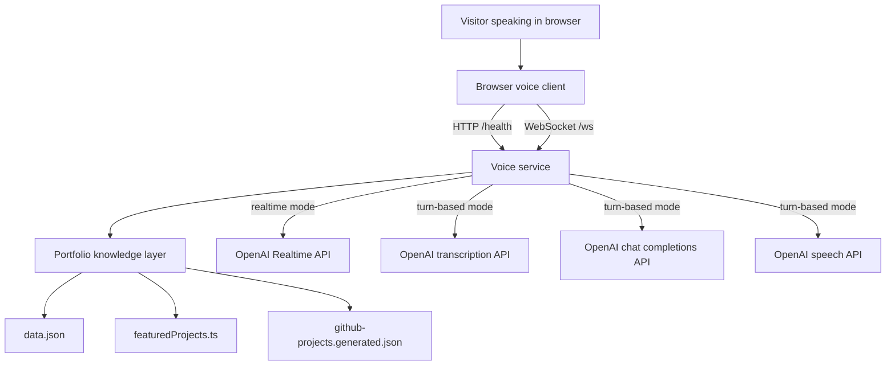
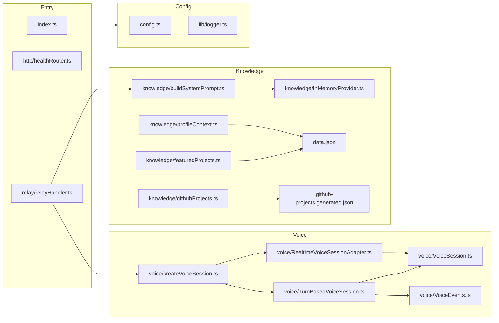
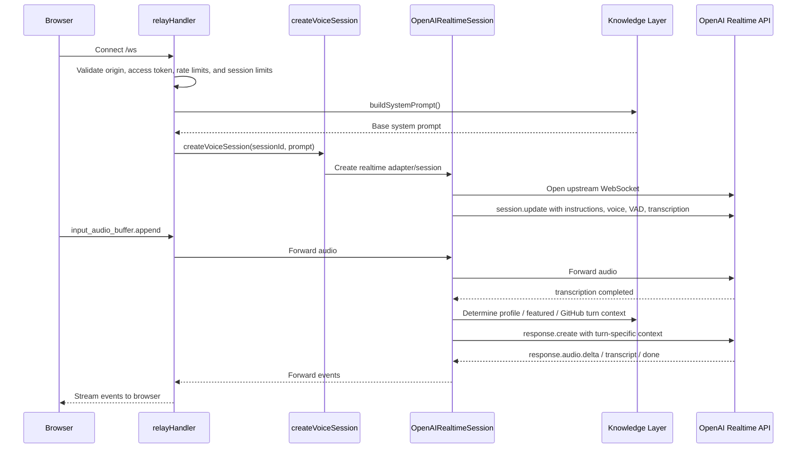
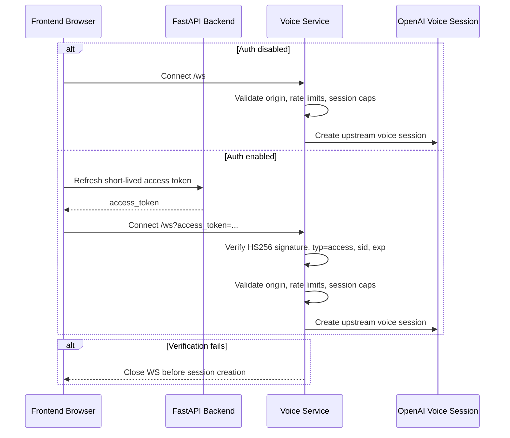
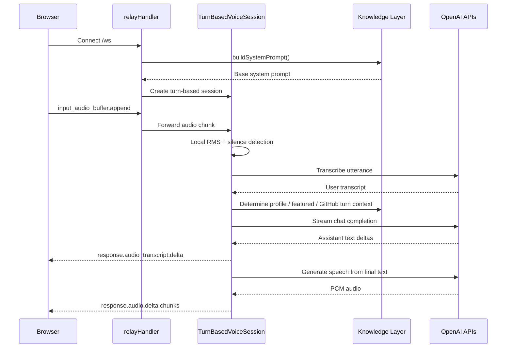

# Architecture

This document describes the architecture implemented in this repository, the reasoning behind it, and the tradeoffs it makes. It is written against the current codebase rather than the aspirational end state.

## Table of Contents

- [System Goals](#system-goals)
- [Architecture Principles](#architecture-principles)
- [System Context](#system-context)
- [Component View](#component-view)
- [Runtime Flows](#runtime-flows)
- [Data and Knowledge Architecture](#data-and-knowledge-architecture)
- [Architectural Decisions](#architectural-decisions)
- [Risk Areas and Follow-Ups](#risk-areas-and-follow-ups)

## System Goals

The service exists to deliver a voice-first portfolio experience with these priorities:

- make Yubi's portfolio feel conversational rather than static
- keep first response latency low enough to feel natural
- ground answers in precomputed portfolio knowledge rather than improvised model memory
- support both a premium real-time path and a cheaper fallback path
- keep the backend small, understandable, and easy to extend

## Architecture Principles

The codebase follows a few consistent ideas:

- composition root at the edge, business logic in dedicated modules
- provider abstractions where future storage or transport swaps are likely
- keep prompt construction separate from transport concerns
- keep browser protocol stable even when backend mode changes
- prefer local retrieval over live external fetches during user conversations
- enforce cheap operational guardrails early instead of adding them after usage grows

## System Context

At a system boundary level, the service is a relay-plus-orchestrator. It is not a general application server and it is not a full frontend host. Its job is to own the conversation backend and the grounding logic required for that backend.

## Component View

## Runtime Flows

### Realtime Request and Response Flow

Important nuance: the Realtime path sets `turn_detection.create_response` to `false` and triggers `response.create` manually only after transcription is available. That choice is central to how the service preserves grounding quality.

### WebSocket Auth Admission Flow

This is intentionally verification-only in the voice service. Token issuance and refresh remain owned by the FastAPI backend.

Current policy note: access tokens are checked only during WebSocket admission. Once the session is accepted, the conversation continues until disconnect, inactivity timeout, or hard session duration closes it.

### Turn-Based Request and Response Flow

The turn-based path reproduces the browser-facing behavior without relying on Realtime-specific infrastructure. It is deliberately more stateful on the server because the server owns utterance segmentation, short-term history, cancellation, and TTS chunking.

## Data and Knowledge Architecture

### Base Knowledge

`data.json` holds durable, curated profile facts that should always be available at session start:

- `profile:summary`
- `profile:skills`
- `projects:top`
- `profile:experience`
- `profile:contact`

This base knowledge is loaded through `InMemoryProvider`, not read ad hoc throughout the application. That indirection is small today, but it creates the swap point for a future Redis-backed provider.

### Featured Project Layer

Broad project questions are often ambiguous. A query like "what project are you most proud of?" is not a retrieval problem in the same way that "tell me about matchcast" is. The featured-project layer exists to answer those high-level portfolio questions from curated context rather than from raw repository search.

### GitHub Retrieval Layer

The GitHub catalog is synced offline into structured project cards. At runtime:

1. exact and alias matches are tried first
2. query intent is inferred
3. MiniSearch searches names, descriptions, languages, topics, and keywords
4. ranking heuristics boost featured projects, intent signals, and exact matches
5. only the top few project cards are injected into the turn context

This is a deliberate prompt-budget control mechanism. The service avoids stuffing the entire GitHub portfolio into the base prompt.

## Architectural Decisions

Each decision below records the problem, the chosen solution, and the reasoning.

### AD-01: Use a dedicated Node.js voice service instead of folding voice into an existing backend

**Problem**

The system needs a long-lived audio session manager with WebSocket handling, low-latency event forwarding, and voice-mode-specific orchestration. Mixing that directly into another backend would blur boundaries between conversation transport and general application logic.

**Decision / Solution**

Create a standalone Node.js service whose main responsibilities are HTTP health, browser WebSocket handling, voice session orchestration, and prompt grounding.

**Why this approach**

- Node.js is a strong fit for WebSocket streaming and event-oriented session control.
- The composition root stays small and explicit.
- Voice-specific operational concerns can evolve independently of the rest of the portfolio stack.

**Consequences**

- Positive: clear ownership and a simpler mental model
- Positive: easier to deploy and scale separately later
- Negative: another service boundary to operate
- Negative: integration with the main portfolio frontend/backend must be managed explicitly

### AD-02: Use a server-side relay instead of letting the browser connect directly to OpenAI

**Problem**

The browser should not hold provider secrets, and the service needs control over session instructions, guardrails, and dynamic prompt injection.

**Decision / Solution**

The browser connects only to `/ws`. The server then opens and manages the upstream OpenAI connection on behalf of the browser.

**Why this approach**

- keeps API keys off the client
- centralizes system prompt injection and guardrails
- allows token checks, origin checks, session caps, and server-side logging
- preserves the option to swap or augment upstream providers later

**Consequences**

- Positive: stronger control plane for cost and safety
- Positive: easier observability and troubleshooting
- Negative: extra network hop
- Negative: server must handle session lifecycle correctly to avoid leaks

### AD-03: Support both Realtime and turn-based backends behind a shared voice-session abstraction

**Problem**

The best conversational UX and the best cost profile are not the same thing. The system needs a premium path and a cheaper path without forcing frontend rewrites.

**Decision / Solution**

Introduce `VoiceSession` plus a `createVoiceSession` factory. Implement one adapter for the existing Realtime path and one first-class `TurnBasedVoiceSession`.

**Why this approach**

- keeps transport selection in one place
- lets the relay operate against one contract
- protects the current Realtime behavior while adding a cheaper option

**Consequences**

- Positive: mode switching is configuration-driven
- Positive: future voice backends have an obvious integration seam
- Negative: event normalization is still incomplete across implementations
- Negative: some duplicate conceptual behavior exists because the protocols differ materially

### AD-04: Build the base prompt from provider-backed structured knowledge rather than reading ad hoc markdown or freeform docs

**Problem**

Persona grounding must be reliable, fast, and consistent across every session. Freeform documents are harder to keep stable and harder to query selectively.

**Decision / Solution**

Store curated profile data in `data.json`, load it through `KnowledgeProvider`, and construct the base system prompt once at session start.

**Why this approach**

- structured keys are easier to reason about than prompt scraping
- prompt construction remains deterministic
- the provider abstraction is enough to support a future Redis implementation

**Consequences**

- Positive: fast startup and predictable prompt shape
- Positive: easier future storage swap
- Negative: requires manual curation of structured data
- Negative: not suitable for large or frequently changing corpora by itself

### AD-05: Keep the full GitHub catalog off the base prompt and retrieve only top-k project cards per turn

**Problem**

Including the entire GitHub portfolio in every session would bloat the prompt, dilute relevance, and increase cost.

**Decision / Solution**

Precompute a local GitHub project catalog offline, search it at runtime with exact matching plus MiniSearch, and inject only the best-matching project cards per turn.

**Why this approach**

- preserves prompt budget for the most relevant facts
- avoids live GitHub API dependency during user conversations
- keeps latency predictable and local

**Consequences**

- Positive: broad repo coverage without massive prompt inflation
- Positive: no live dependency on GitHub availability at runtime
- Negative: synced data can become stale until refreshed
- Negative: ranking quality depends on heuristics and manual signals

### AD-06: In Realtime mode, disable automatic response generation and trigger `response.create` only after transcription completes

**Problem**

Automatic Realtime responses are fast, but they would respond before the service has a chance to compute dynamic portfolio context based on the user's actual utterance.

**Decision / Solution**

Set `turn_detection.create_response` to `false` and send `response.create` only after `conversation.item.input_audio_transcription.completed` arrives.

**Why this approach**

- dynamic profile and project routing requires transcript-aware context selection
- broad questions need curated routing, not generic immediate answering
- this preserves grounding quality in the path where improvisation would otherwise be easiest

**Consequences**

- Positive: better grounded responses in Realtime mode
- Positive: same retrieval logic can conceptually serve both voice modes
- Negative: slightly more orchestration complexity
- Negative: some latency is traded for answer quality

### AD-07: Add admission control in the relay layer before voice sessions are created

**Problem**

Voice sessions are expensive compared with simple text requests, and WebSocket endpoints are easy to abuse if left entirely open.

**Decision / Solution**

Implement origin checks, FastAPI-compatible access-token verification, per-process connection and control-message rate limits, maximum concurrent sessions, inactivity timeouts, and hard session duration caps in the relay/config layer.

**Why this approach**

- these controls are cheap to implement and immediately reduce operational risk
- the relay is the earliest point where session admission can be controlled
- they ensure unauthenticated traffic never consumes an upstream OpenAI voice session
- they reuse the same token format already used by the primary FastAPI backend

**Consequences**

- Positive: reduced accidental cost exposure
- Positive: predictable session cleanup behavior
- Positive: short-lived access tokens can gate expensive voice sessions without duplicating token issuance here
- Negative: in-memory rate limits only apply per process
- Negative: browser WebSocket auth still needs query-param or subprotocol transport because browsers cannot set arbitrary upgrade headers
- Negative: an already-admitted voice session can outlive the original access-token expiry until normal session limits close it

### AD-08: Use a development-only browser test page as the integration harness

**Problem**

Voice pipelines are hard to validate with unit tests alone, especially when they involve browser audio capture, playback timing, interruption, and provider event streams.

**Decision / Solution**

Serve `public/test.html` in development mode and use it as the manual end-to-end test harness for both backends.

**Why this approach**

- enables fast iteration without waiting on full React integration
- keeps the backend verifiable even before the portfolio frontend is ready
- makes protocol debugging visible through transcript and event logs

**Consequences**

- Positive: rapid manual validation loop
- Positive: easier debugging of timing and event ordering problems
- Negative: not a replacement for automated tests
- Negative: the test client reflects current protocol realities, including some backend-specific event details

### AD-09: Keep logging structured and file-backed from the start

**Problem**

Streaming voice issues are often temporal and hard to reproduce. Without request-scoped logs, debugging disconnections, cancellations, and mode-specific failures becomes slow.

**Decision / Solution**

Use a small JSON logger that writes to both console and rolling daily log files, including session IDs and event metadata where relevant.

**Why this approach**

- structured logs are much easier to scan or ingest later than freeform text
- file-backed logs preserve evidence across interactive sessions
- the implementation stays small and dependency-light

**Consequences**

- Positive: better post-mortem debugging capability
- Positive: low implementation overhead
- Negative: no centralized aggregation yet
- Negative: retention and rotation are still minimal

## Risk Areas and Follow-Ups

The current architecture is solid for iterative development and demos, but several areas still need strengthening before broad production exposure:

- distributed rate limiting if the service is ever scaled past one instance
- tighter integration testing around token refresh and reconnect behavior
- normalization of the browser-facing event contract across both voice backends
- automated tests around prompt routing, retrieval, and session lifecycle
- deployment packaging and environment-specific operational configuration
- explicit freshness strategy for GitHub sync data

## Summary

The architecture favors a clear separation between transport, orchestration, and knowledge grounding. Its central bet is that a small dedicated relay with dynamic local retrieval is a better fit for a portfolio voice assistant than either a huge always-on prompt or a fully generic chat backend. The result is a service that is straightforward to reason about, adaptable to different cost/latency modes, and grounded enough to present Yubi's work credibly.