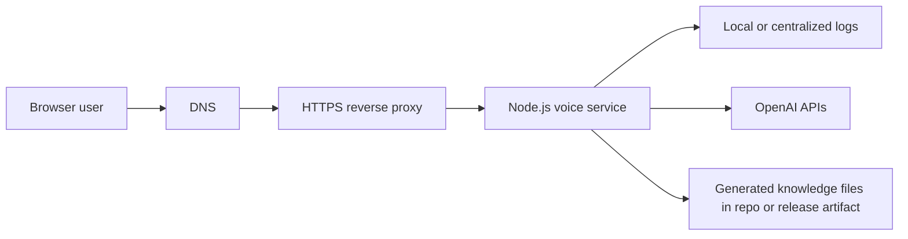

# Deployment and Operations

This document is the practical companion to [docs/ARCHITECTURE.md](docs/ARCHITECTURE.md). It focuses on how to run the service safely, what to configure, what to verify before release, and how to respond if something goes wrong.

## Table of Contents

- [Deployment Goals](#deployment-goals)
- [Recommended Production Shape](#recommended-production-shape)
- [Environment Strategy](#environment-strategy)
- [Pre-Deploy Checklist](#pre-deploy-checklist)
- [Deployment Procedure](#deployment-procedure)
- [Post-Deploy Verification](#post-deploy-verification)
- [Runtime Operations](#runtime-operations)
- [Incident Response and Rollback](#incident-response-and-rollback)
- [Security and Cost Controls](#security-and-cost-controls)
- [What Is Still Missing](#what-is-still-missing)

## Deployment Goals

The service should be deployed in a way that preserves the main architectural priorities:

- low-latency WebSocket handling
- clear isolation of provider credentials
- predictable cost under low to moderate traffic
- fast diagnosis of failures using structured logs
- minimal moving parts until stronger production controls are added

## Recommended Production Shape



Recommended baseline:

- run one Node.js process behind HTTPS and a reverse proxy
- terminate TLS at the proxy layer
- expose HTTP health checks and WebSocket upgrade support on the same origin
- keep generated GitHub knowledge files part of the deploy artifact unless you explicitly automate sync in your release flow

Suitable hosting shapes:

- a small VM or VPS with `systemd` and Nginx or Caddy
- a platform that supports long-lived WebSockets cleanly
- a container platform such as Google Cloud Run once container artifacts and secret wiring are in place

## Environment Strategy

Use [.env.example](../.env.example) as the baseline for required and optional variables.

Suggested production-oriented values:

- `NODE_ENV=production`
- `VOICE_MODE=turn-based` for the initial low-cost Cloud Run rollout, or `realtime` later if the higher-cost duplex experience is worth it
- `ALLOWED_ORIGINS` set to the exact production frontend origins
- `MAX_CONCURRENT_SESSIONS` set conservatively at first
- `INACTIVITY_TIMEOUT_MS` and `MAX_SESSION_DURATION_MS` kept finite and intentionally small
- `REQUIRE_AUTH=true` once the real frontend is sending FastAPI-issued access tokens
- `MAX_SESSION_DURATION_MS=900000` as the currently verified Cloud Run setting (15 min)

Operational advice:

- never commit real secrets into `.env.example` or the repository
- inject secrets through the deployment platform or host secret store
- treat `GITHUB_TOKEN` as optional in production unless sync is part of the runtime or release process

## Pre-Deploy Checklist

Before shipping a release:

1. Run `npm install`.
2. Run `npm run typecheck`.
3. Run `npm run build`.
4. Confirm the correct `.env` values for the target environment.
5. Confirm `ALLOWED_ORIGINS` is not empty in production.
6. Confirm `REQUIRE_AUTH` and `AUTH_SIGNING_SECRET` match the intended frontend auth behavior.
7. Confirm any reverse proxy or platform logs do not record full WebSocket URLs with query strings.
8. Confirm the GitHub catalog file is present and up to date if repo retrieval is expected to work.
9. Review whether `VOICE_MODE` matches the intended cost and UX profile for the environment.
10. Confirm the host or platform supports WebSocket upgrades and long-lived connections.

## Deployment Procedure

This repository now includes a basic `Dockerfile` and `.dockerignore` suitable for Google Cloud Run source deployments. It does not yet include IaC or CI/CD release automation.

### Verified Cloud Run flow

This is the exact deployment shape that was successfully verified for the current portfolio rollout.

Verified platform configuration:

- Google Cloud project: `yubi-portfolio-voice-chat`
- Region: `australia-southeast1`
- Cloud Run service: `yubi-voice-service`
- Public service URL: `https://yubi-voice-service-69604910031.australia-southeast1.run.app`
- Frontend origin allowlist: `https://www.yubikhadka.com`
- Voice mode: `turn-based`
- Cloud Run min instances: `0`
- Cloud Run max instances: `1`
- Cloud Run concurrency: `3`
- Cloud Run timeout: `900s`
- Runtime memory: `512Mi`
- Runtime CPU: `1`
- Current auth posture: `REQUIRE_AUTH=true`

Secrets used:

- `openai-api-key` stored in Google Secret Manager
- `auth-signing-secret` stored in Google Secret Manager

Required APIs:

- `run.googleapis.com`
- `cloudbuild.googleapis.com`
- `artifactregistry.googleapis.com`
- `secretmanager.googleapis.com`

Important IAM note:

- The Cloud Run runtime service account needed `roles/secretmanager.secretAccessor` to read `openai-api-key`

### Verified Cloud Run command sequence

Use this sequence when reproducing the deployment manually with `gcloud`.

1. Select the target project:

```bash
gcloud config set project yubi-portfolio-voice-chat
```

2. Set the default Cloud Run region:

```bash
gcloud config set run/region australia-southeast1
```

3. Enable required services:

```bash
gcloud services enable run.googleapis.com cloudbuild.googleapis.com artifactregistry.googleapis.com secretmanager.googleapis.com
```

4. Create the OpenAI secret container:

```bash
gcloud secrets create openai-api-key --replication-policy=automatic
```

5. Add the secret value as the first version:

```bash
echo -n "YOUR_OPENAI_API_KEY" | gcloud secrets versions add openai-api-key --data-file=-
```

6. Grant the Cloud Run runtime identity access to secrets:

```bash
gcloud projects add-iam-policy-binding yubi-portfolio-voice-chat \
  --member="serviceAccount:69604910031-compute@developer.gserviceaccount.com" \
  --role="roles/secretmanager.secretAccessor"
```

7. Create the auth signing secret container:

```bash
gcloud secrets create auth-signing-secret --replication-policy=automatic
```

8. Add the signing secret value:

```bash
echo -n "YOUR_FASTAPI_AUTH_SIGNING_SECRET" | gcloud secrets versions add auth-signing-secret --data-file=-
```

9. Deploy from source for the initial smoke test:

```bash
gcloud run deploy yubi-voice-service \
  --source . \
  --region australia-southeast1 \
  --allow-unauthenticated \
  --set-secrets OPENAI_API_KEY=openai-api-key:latest \
  --set-env-vars NODE_ENV=production,REQUIRE_AUTH=false,ALLOWED_ORIGINS=https://www.yubikhadka.com,VOICE_MODE=turn-based,OPENAI_VOICE=cedar,MAX_SESSION_DURATION_MS=900000,MAX_CONCURRENT_SESSIONS=3,INACTIVITY_TIMEOUT_MS=30000,TURN_BASED_TRANSCRIPTION_MODEL=whisper-1,TURN_BASED_CHAT_MODEL=gpt-4o-mini,TURN_BASED_TTS_MODEL=gpt-4o-mini-tts,TURN_BASED_SILENCE_THRESHOLD=0.015,TURN_BASED_SILENCE_DURATION_MS=700,TURN_BASED_MIN_SPEECH_DURATION_MS=250,TURN_BASED_PCM_CHUNK_BYTES=4800,TURN_BASED_MAX_HISTORY_MESSAGES=8 \
  --min-instances=0 \
  --max-instances=1 \
  --concurrency=3 \
  --cpu=1 \
  --memory=512Mi \
  --timeout=900
```

10. Redeploy with auth enabled:

```bash
gcloud run deploy yubi-voice-service \
  --source . \
  --region australia-southeast1 \
  --allow-unauthenticated \
  --set-secrets OPENAI_API_KEY=openai-api-key:latest,AUTH_SIGNING_SECRET=auth-signing-secret:latest \
  --set-env-vars NODE_ENV=production,REQUIRE_AUTH=true,VOICE_AUTH_QUERY_PARAM=access_token,ALLOWED_ORIGINS=https://www.yubikhadka.com,VOICE_MODE=turn-based,OPENAI_VOICE=cedar,MAX_SESSION_DURATION_MS=900000,MAX_CONCURRENT_SESSIONS=3,INACTIVITY_TIMEOUT_MS=30000,TURN_BASED_TRANSCRIPTION_MODEL=whisper-1,TURN_BASED_CHAT_MODEL=gpt-4o-mini,TURN_BASED_TTS_MODEL=gpt-4o-mini-tts,TURN_BASED_SILENCE_THRESHOLD=0.015,TURN_BASED_SILENCE_DURATION_MS=700,TURN_BASED_MIN_SPEECH_DURATION_MS=250,TURN_BASED_PCM_CHUNK_BYTES=4800,TURN_BASED_MAX_HISTORY_MESSAGES=8 \
  --min-instances=0 \
  --max-instances=1 \
  --concurrency=3 \
  --cpu=1 \
  --memory=512Mi \
  --timeout=900
```

Notes on these commands:

- `--source .` uses Cloud Build, which is useful when Docker is unavailable locally
- `--allow-unauthenticated` exposes the Cloud Run URL publicly, while app-level access is still shaped by `ALLOWED_ORIGINS` and later `REQUIRE_AUTH`
- `--timeout=900` allows long-lived WebSocket voice sessions
- `min-instances=0` keeps idle cost near zero
- `max-instances=1` plus `concurrency=3` keeps the rollout intentionally small
- `MAX_CONCURRENT_SESSIONS=3` is the app-level session cap inside that one container instance
- the second deploy injects `AUTH_SIGNING_SECRET` and turns on access-token verification for `/ws`

### Current frontend wiring

The current frontend integration uses:

- `VITE_VOICE_ENABLED=true`
- `VITE_VOICE_WS_URL=wss://yubi-voice-service-69604910031.australia-southeast1.run.app/ws`
- `VITE_REQUIRE_AUTH=true`

### Generic host-based flow

1. Pull or upload the release artifact to the server.
2. Install dependencies with `npm install`.
3. Build with `npm run build`.
4. Provide environment variables securely.
5. Start the process with a supervisor such as `systemd`, PM2, or the host platform's native process manager.
6. Put the service behind HTTPS with WebSocket support.

### Example `systemd` service

```ini
[Unit]
Description=Yubi Portfolio Voice Service
After=network.target

[Service]
Type=simple
WorkingDirectory=/srv/yubi-portfolio-voice-service
EnvironmentFile=/srv/yubi-portfolio-voice-service/.env
ExecStart=/usr/bin/node dist/index.js
Restart=always
RestartSec=5
User=www-data
Group=www-data

[Install]
WantedBy=multi-user.target
```

### Example reverse proxy concerns

The reverse proxy must support:

- HTTP health traffic
- WebSocket upgrade forwarding on `/ws`
- TLS termination
- reasonable idle timeouts for voice sessions

If the proxy kills idle upgraded connections too aggressively, users will see random mid-session disconnects that look like application errors.

## Post-Deploy Verification

After deployment, verify the system in this order:

1. Confirm the process starts without configuration errors.
2. Confirm `GET /health` returns `200` with `{ "status": "ok" }`.
3. Confirm browser access from an allowed origin works.
4. Confirm a WebSocket connection to `/ws` upgrades successfully.
5. Confirm a full voice round-trip works in the configured mode.
6. Confirm logs show session creation and completion without repeated upstream errors.
7. Confirm session timeout and capacity controls behave as expected.

Manual smoke test checklist:

- ask "tell me about yourself" and verify identity grounding
- ask about a featured project and verify concise portfolio grounding
- ask about a specific GitHub repo and verify retrieval works
- interrupt the assistant mid-response and verify cancellation behavior

Verified Cloud Run checks already performed:

- `GET /health` returned `200` with `{ "status": "ok" }`
- a plain `curl` to `/ws` returned `404 Cannot GET /ws`, which is expected because `/ws` is WebSocket-only and not an Express HTTP route
- a real WebSocket client (`wscat`) connected successfully to `wss://yubi-voice-service-69604910031.australia-southeast1.run.app/ws` with `Origin: https://www.yubikhadka.com` before auth was enabled
- the deployed service emitted `session.created` and `session.updated` events in `turn-based` mode
- after `REQUIRE_AUTH=true`, an unauthenticated `wscat` connection was rejected with close code `1008` and reason `Unauthorized`
- an end-to-end voice conversation from `https://www.yubikhadka.com` completed successfully against the deployed Cloud Run backend after frontend auth was enabled

## Runtime Operations

Operationally important runtime facts:

- logs are written to daily files in `logs/`
- debug logs are suppressed in console output outside development, but file logs still capture them
- the service closes sessions on inactivity and hard duration limits
- the relay rejects new sessions once `MAX_CONCURRENT_SESSIONS` is reached

Useful checks during operation:

- watch for repeated `OpenAI API error event` log lines
- watch for frequent `inactivity` or `max_duration` closures if users complain about dropped sessions
- watch for `Server at capacity` style behavior if traffic grows beyond the configured cap
- watch for stale GitHub project answers after portfolio changes, which likely means the generated catalog needs a fresh sync

## Incident Response and Rollback

### If sessions fail immediately

Check in this order:

1. environment variables loaded correctly
2. OpenAI credentials valid
3. reverse proxy still allows WebSocket upgrade
4. `ALLOWED_ORIGINS` includes the real frontend origin
5. provider-side model availability and account access

### If answers become low quality or off-topic

Check in this order:

1. `src/knowledge/data.json` still reflects the intended source-of-truth
2. `src/knowledge/github-projects.generated.json` is current
3. the app is running the intended release artifact
4. `VOICE_MODE` matches the environment expectations

### Rollback approach

Because the service is stateless at runtime, rollback is simple:

1. identify the previous healthy Cloud Run revision
2. shift traffic back to that revision or redeploy the previous known-good configuration
3. restore the previous environment or secret references if config changed
4. rerun `/health`, WebSocket handshake, and one frontend smoke test

If a release changed only knowledge files and not code, a rollback can be as small as restoring the previous generated knowledge assets and restarting the process.

## Security and Cost Controls

Controls already present in the app:

- origin allowlist support
- FastAPI-compatible access-token verification on `/ws`
- per-process connection and control-message rate limiting
- session concurrency cap
- cumulative inbound audio cap per session
- inactivity timeout
- hard session duration cap
- server-side secret handling

Important auth behavior:

- browser clients currently send the short-lived access token as a WebSocket query parameter
- access tokens are validated only at connect time; accepted sessions are then bounded by inactivity and max-duration limits rather than minute-by-minute re-authentication
- this is a deliberate UX tradeoff for long-lived voice sessions
- production logs and reverse proxies should avoid storing full request URLs with query strings
- current Cloud Run request logs do record `/ws?access_token=...` for successful authenticated WebSocket upgrades, so query-string token exposure is a confirmed follow-up item rather than a theoretical one

Current decision on query-string token transport:

- keep the current `?access_token=` transport for now
- rationale: the access token TTL is currently only `30s`, the service is low traffic, and the current deployment/auth rollout is working cleanly
- this is accepted as a pragmatic tradeoff for the current project stage, not as an ideal long-term auth transport

Candidate follow-up options:

1. Keep query-string transport as-is
   - Pros: zero implementation effort, no protocol changes, current frontend/backend flow remains stable
   - Cons: short-lived bearer tokens continue to appear in Cloud Run request logs

2. Move the auth token to `Sec-WebSocket-Protocol`
   - Pros: removes the token from the URL, avoids the current query-string logging path, relatively small frontend/backend change
   - Cons: this header is intended for subprotocol negotiation rather than auth, implementation is more awkward, and it is still not as strong as a dedicated one-time ticket flow

3. Introduce a one-time voice connection ticket
   - Pros: strongest model for this architecture, avoids exposing the main access token during WebSocket connect, can be very short-lived and single-use
   - Cons: requires more backend/frontend work and an additional ticket-issuance flow

Controls that should be added before wider public exposure:

- stronger logging and alerting integration
- deployment-level secret rotation and audit trail
- refresh-token migration to `httpOnly` cookies in the main FastAPI backend
- optional distributed rate limiting if the service is scaled horizontally

Current billing protection already in place:

- a `5 AUD` monthly Cloud Billing budget scoped to project `yubi-portfolio-voice-chat`
- alert thresholds at `50%`, `90%`, and `100%`
- this budget is alerting-only; it does not automatically shut down Cloud Run or OpenAI usage
- the backend also supports `MAX_AUDIO_SECONDS_PER_SESSION`, which is measured in seconds and caps cumulative inbound user audio per session
- current recommended production value for `MAX_AUDIO_SECONDS_PER_SESSION`: `480` (8 minutes)

Recommended production posture today:

- keep traffic limited to your own frontend origin
- use modest concurrency limits
- monitor logs closely after release
- prefer staged rollout before linking the feature publicly

## What Is Still Missing

This runbook is intentionally honest about the current state. The following are still missing from the repository itself:

- deployment manifests
- CI pipeline for build and release
- automated health smoke tests
- centralized logging setup

What remains incomplete is not deployability, but deeper production hardening: distributed rate limits and future reconsideration of the current query-string token transport/log-hygiene tradeoff.

That means the service is deployable, but it is still in the "careful controlled rollout" stage rather than a fully hardened public-service stage.

## GitHub Actions CI/CD

The repository now includes a first-pass GitHub Actions workflow at [.github/workflows/deploy-cloud-run.yml](../.github/workflows/deploy-cloud-run.yml).

What the workflow does:

- runs only on manual `workflow_dispatch`
- installs dependencies and runs `npm run typecheck`
- authenticates to Google Cloud using Workload Identity Federation
- builds a Docker image and pushes it to Artifact Registry
- deploys that image to the existing Cloud Run service

The workflow assumes the currently verified production configuration:

- project: `yubi-portfolio-voice-chat`
- region: `australia-southeast1`
- Artifact Registry repository: `yubi-voice-service`
- Cloud Run service: `yubi-voice-service`
- auth enabled via `AUTH_SIGNING_SECRET`
- current turn-based production env var set

One-time prerequisite outside the workflow:

- create the Artifact Registry Docker repository manually before the first workflow run:

```bash
gcloud artifacts repositories create yubi-voice-service \
  --repository-format=docker \
  --location=australia-southeast1 \
  --description="Docker images for yubi-portfolio-voice-service"
```

Required GitHub repository secrets:

- `GCP_WORKLOAD_IDENTITY_PROVIDER`
- `GCP_SERVICE_ACCOUNT`

Recommended GCP IAM for the deployment service account:

- `roles/run.admin`
- `roles/artifactregistry.writer`
- `roles/iam.serviceAccountUser`
- `roles/secretmanager.secretAccessor`

Recommended next validation after wiring those secrets:

1. trigger the workflow manually with `workflow_dispatch`
2. confirm the image is pushed to Artifact Registry
3. confirm Cloud Run creates a new revision from the pushed image
4. rerun `/health`, unauthenticated `wscat`, and the real frontend smoke test

Current status:

- Workload Identity Federation is configured and working
- GitHub repository secrets are configured
- the Artifact Registry Docker repository exists
- a manual `workflow_dispatch` run completed successfully
- the manual image-based Cloud Run deployment path is now validated
- the max-audio session guard was manually verified locally with a low temporary value and clean `max_audio` session closure
