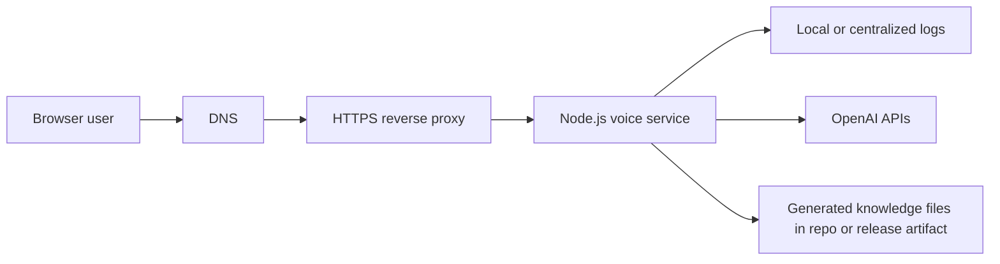

# Deployment and Operations

This document is the practical companion to [docs/ARCHITECTURE.md](docs/ARCHITECTURE.md). It focuses on how to run the service safely, what to configure, what to verify before release, and how to respond if something goes wrong.

## Table of Contents

- [Deployment Goals](#deployment-goals)
- [Recommended Production Shape](#recommended-production-shape)
- [Environment Strategy](#environment-strategy)
- [Pre-Deploy Checklist](#pre-deploy-checklist)
- [Deployment Procedure](#deployment-procedure)
- [Post-Deploy Verification](#post-deploy-verification)
- [Runtime Operations](#runtime-operations)
- [Incident Response and Rollback](#incident-response-and-rollback)
- [Security and Cost Controls](#security-and-cost-controls)
- [What Is Still Missing](#what-is-still-missing)

## Deployment Goals

The service should be deployed in a way that preserves the main architectural priorities:

- low-latency WebSocket handling
- clear isolation of provider credentials
- predictable cost under low to moderate traffic
- fast diagnosis of failures using structured logs
- minimal moving parts until stronger production controls are added

## Recommended Production Shape



Recommended baseline:

- run one Node.js process behind HTTPS and a reverse proxy
- terminate TLS at the proxy layer
- expose HTTP health checks and WebSocket upgrade support on the same origin
- keep generated GitHub knowledge files part of the deploy artifact unless you explicitly automate sync in your release flow

Suitable hosting shapes:

- a small VM or VPS with `systemd` and Nginx or Caddy
- a platform that supports long-lived WebSockets cleanly
- a container platform, but only after adding the missing deployment artifacts separately

## Environment Strategy

Use [.env.example](../.env.example) as the baseline for required and optional variables.

Suggested production-oriented values:

- `NODE_ENV=production`
- `VOICE_MODE=realtime` for best experience, or `turn-based` for lower cost
- `ALLOWED_ORIGINS` set to the exact production frontend origins
- `MAX_CONCURRENT_SESSIONS` set conservatively at first
- `INACTIVITY_TIMEOUT_MS` and `MAX_SESSION_DURATION_MS` kept finite and intentionally small

Operational advice:

- never commit real secrets into `.env.example` or the repository
- inject secrets through the deployment platform or host secret store
- treat `GITHUB_TOKEN` as optional in production unless sync is part of the runtime or release process

## Pre-Deploy Checklist

Before shipping a release:

1. Run `npm install`.
2. Run `npm run typecheck`.
3. Run `npm run build`.
4. Confirm the correct `.env` values for the target environment.
5. Confirm `ALLOWED_ORIGINS` is not empty in production.
6. Confirm the GitHub catalog file is present and up to date if repo retrieval is expected to work.
7. Review whether `VOICE_MODE` matches the intended cost and UX profile for the environment.
8. Confirm the host or platform supports WebSocket upgrades and long-lived connections.

## Deployment Procedure

This repository does not yet include a Dockerfile, IaC, or platform-specific manifest, so the safest current procedure is a basic Node.js service release.

### Generic host-based flow

1. Pull or upload the release artifact to the server.
2. Install dependencies with `npm install`.
3. Build with `npm run build`.
4. Provide environment variables securely.
5. Start the process with a supervisor such as `systemd`, PM2, or the host platform's native process manager.
6. Put the service behind HTTPS with WebSocket support.

### Example `systemd` service

```ini
[Unit]
Description=Yubi Portfolio Voice Service
After=network.target

[Service]
Type=simple
WorkingDirectory=/srv/yubi-portfolio-voice-service
EnvironmentFile=/srv/yubi-portfolio-voice-service/.env
ExecStart=/usr/bin/node dist/index.js
Restart=always
RestartSec=5
User=www-data
Group=www-data

[Install]
WantedBy=multi-user.target
```

### Example reverse proxy concerns

The reverse proxy must support:

- HTTP health traffic
- WebSocket upgrade forwarding on `/ws`
- TLS termination
- reasonable idle timeouts for voice sessions

If the proxy kills idle upgraded connections too aggressively, users will see random mid-session disconnects that look like application errors.

## Post-Deploy Verification

After deployment, verify the system in this order:

1. Confirm the process starts without configuration errors.
2. Confirm `GET /health` returns `200` with `{ "status": "ok" }`.
3. Confirm browser access from an allowed origin works.
4. Confirm a WebSocket connection to `/ws` upgrades successfully.
5. Confirm a full voice round-trip works in the configured mode.
6. Confirm logs show session creation and completion without repeated upstream errors.
7. Confirm session timeout and capacity controls behave as expected.

Manual smoke test checklist:

- ask "tell me about yourself" and verify identity grounding
- ask about a featured project and verify concise portfolio grounding
- ask about a specific GitHub repo and verify retrieval works
- interrupt the assistant mid-response and verify cancellation behavior

## Runtime Operations

Operationally important runtime facts:

- logs are written to daily files in `logs/`
- debug logs are suppressed in console output outside development, but file logs still capture them
- the service closes sessions on inactivity and hard duration limits
- the relay rejects new sessions once `MAX_CONCURRENT_SESSIONS` is reached

Useful checks during operation:

- watch for repeated `OpenAI API error event` log lines
- watch for frequent `inactivity` or `max_duration` closures if users complain about dropped sessions
- watch for `Server at capacity` style behavior if traffic grows beyond the configured cap
- watch for stale GitHub project answers after portfolio changes, which likely means the generated catalog needs a fresh sync

## Incident Response and Rollback

### If sessions fail immediately

Check in this order:

1. environment variables loaded correctly
2. OpenAI credentials valid
3. reverse proxy still allows WebSocket upgrade
4. `ALLOWED_ORIGINS` includes the real frontend origin
5. provider-side model availability and account access

### If answers become low quality or off-topic

Check in this order:

1. `src/knowledge/data.json` still reflects the intended source-of-truth
2. `src/knowledge/github-projects.generated.json` is current
3. the app is running the intended release artifact
4. `VOICE_MODE` matches the environment expectations

### Rollback approach

Because the service is stateless at runtime, rollback is simple:

1. redeploy the previous known-good build artifact
2. restore the previous environment configuration if config changed
3. restart the service process
4. rerun the smoke checks

If a release changed only knowledge files and not code, a rollback can be as small as restoring the previous generated knowledge assets and restarting the process.

## Security and Cost Controls

Controls already present in the app:

- origin allowlist support
- session concurrency cap
- inactivity timeout
- hard session duration cap
- server-side secret handling

Controls that should be added before wider public exposure:

- authenticated session creation or signed access token flow
- rate limiting at the edge or application layer
- stronger logging and alerting integration
- deployment-level secret rotation and audit trail

Recommended production posture today:

- keep traffic limited to your own frontend origin
- use modest concurrency limits
- monitor logs closely after release
- prefer staged rollout before linking the feature publicly

## What Is Still Missing

This runbook is intentionally honest about the current state. The following are still missing from the repository itself:

- Dockerfile
- deployment manifests
- CI pipeline for build and release
- automated health smoke tests
- auth and rate limiting implementation
- centralized logging setup

That means the service is deployable, but it is still in the "careful controlled rollout" stage rather than a fully hardened public-service stage.